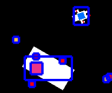
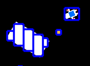
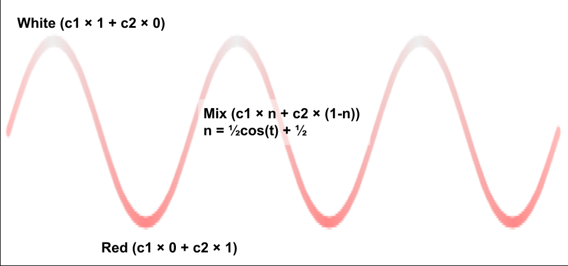

# Spice of Life

Help the homesick astronaut salvage the perfect ingredients from the wrecked cargo ship.

Also available at https://mumind.itch.io/spice-of-life.

## Next steps

 - [x] Storyline intro
 - [x] Ingredients more spread out / challenging to collect
 - [x] Pointer behavior fixed
 - [x] Improve controls
 - [x] Sprite for shuttle
 - [ ] Normalize gameplay for screen size
 - [x] Publish on itch.io
 - [ ] Balance the gameplay to be more fun (e.g. use up oxygen quicker?)
 - [x] Submit for KaJam
 - [ ] Support mobile

## How it all works

### Stars

Stars are placed randomly in the environment but slightly more clustered around the center of the screen than farther out. This works using a randomized angle/distance formula like `Vec2.fromAngle(rand(360)).scale(rand(3000) ** 1.3`. This exponent shifts the ones that would've been near the center a little bit out but the ones that would've been far from the center way farther out, making them much more sparsely scattered.

### Parallax

Some background objects like stars offer a parallax effect to give a nice feel of distance & movement. This works by continuously tracking the camera movement between updates and shifting the object pos by some proportional distance in the opposite direction.

See the implementation in the `parallax(scale)` component helper in components.js.

### Collision detection

Collisions are detected using Kaboom's current "AABB" algorithm, but Kaboom currently makes no attempt to adjust the collision areas as objects rotate.



In order to improve collision detection accuracy at the edges, the collision areas can be slightly reshaped to minimize the errors in trivial cases (like a long thin rectangle rotated 90°), or even covered piecemeal by several rectangles.



Note: The shuttle area no longer uses this trick. The quirks were noticeably bad when the shuttle was just a rectangle (as shown in screenshots above), but with the new shuttle graphic the proportions are a little different and the default area is close enough after all.

See Kaboom's issues tracking these quirks:

  * [area() collider with rotate #276](https://github.com/replit/kaboom/issues/276) (closed but unresolved)
  * [Pixel Perfect Collision Detection #157](https://github.com/replit/kaboom/issues/157)

### Astronaut motion

The astronaut has momentum and a spin (angular momentum), and air jets to affect the momentum and spin. It updates those by checking which keys are down every update and adding some multiplier of `dt()` to momentum and/or spin depending on which keys are down. Then it applies the current momentum to update the position and rotation (again based on `dt()`).

### Air jets

The air jets use animated sprites that each follow the astronaut with a different offset and rotation. The forward thruster just needs to follow behind the astronaut, so we use a specific origin (`vec2(0, -3)`) to make a point just *above* the sprite follow the center of the astronaut, and then as that moves and rotates the visible sprite trails behind the astronaut.

TODO: Diagram

The left/right steering jets point out to the side near the astronaut's legs, so the central axis of their sprite doesn't actually pass through the exact center of the astronaut and it needs another trick to keep them exactly positioned and angled as the astronaut moves and rotates. That's done by just pivoting them around an origin at their top, but placing that origin at the right angle/distance from the astronaut's center by constantly updating `jet.follow.offset` to a point at a certain angle and distance from the astronaut's center point: `Vec2.fromAngle(astronaut.angle + 90 ± 50).scale(12)`.

TODO: Diagram

### Camera scrolling

To balance between letting the astronaut explore space endlessly and providing a sense of orientation around the center, the camera follows a point between the player and the center.

See also: [Scroll Back: The Theory and Practice of Cameras in Side-Scrollers](https://docs.google.com/document/d/1iNSQIyNpVGHeak6isbP6AHdHD50gs8MNXF1GCf08efg/pub) for a great analysis of the surprising complexity of camera scrolling strategies chosen in different video games.

### Pointer to off-screen shuttle

When the shuttle is off-screen, a pointer appears along the appropriate edge of the screen to cue the player where it went.

This works by projecting a line from the astronaut back to the shuttle to determine where it intersects the edge of the screen (technically a line just inside of the edge).

The pointer is made up of a few shapes stacked on top of each other to render a tiny image of the shuttle inside a circle with a pointer triangle sticking out from it. Then they're all tagged and moved simultaneously in onUpdate to put the pointer in the right place. Finally, the pointer "triangle" (which actually a partially-covered square) is rotated around an origin at the circle's center to point in the exact direction of the shuttle.

### Color strobing

When the player gets low on oxygen, a flashing red "WARNING!" indicator appears to alert them they need to get back to the shuttle. This works using a text transform function (CharTransformFunc) to smoothly shift from one color to the other and back again. It uses kaboom's [`wave(lo, hi, t)`](https://kaboomjs.com/#wave) helper to scale the color values according to a sine wave.



To get the color shifting just right, it scales/shifts the value so that at time `t0` it's at its minimum value (`sin(-π/2) = -1`) and it cycles back to that minimum every .8s (`sin(1½π) = -1`, so it uses the formula `sin(2π*.8t - π/2)`).

See the implementation in the `textTransformCycleColors(c1, c2, rate)` helper in main.js.

## Publishing to itch.io

Basic instructions for publishing an updated version to itch.io are:

1. Download from Replit (via sidebar > Files > dots menu > Download as zip)
2. [Install itch.io butler] if not already installed
3. Unpack and change directory into the root (should see dist/, sprites/ etc)
4. Edit dist/game.js to add `loadRoot("../")` before the first call to `loadSound` and other `loadFoo` helpers
5. In dist/index.html, change any `/dist/*.js` to `./*.js` and delete the replit-badge part
6. Log in to itch.io in butler: `butler login`
7. Push the files to the "web" channel:
   ```sh
   butler push . \
     --ignore=code --ignore=diagrams \
     --ignore=learn --ignore=README.md \
     --ignore=run.js --ignore=helper.ts \
     --ignore=template.html --ignore=node_modules \
     --ignore=.* --ignore=replit.nix \
     --ignore=replit_zip_error_log.txt \
     mumind/spice-of-life:web
   ```

[Install itch.io butler]: https://itch.io/docs/butler/installing.html